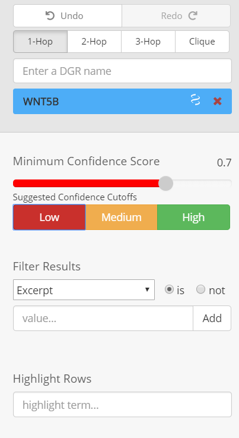
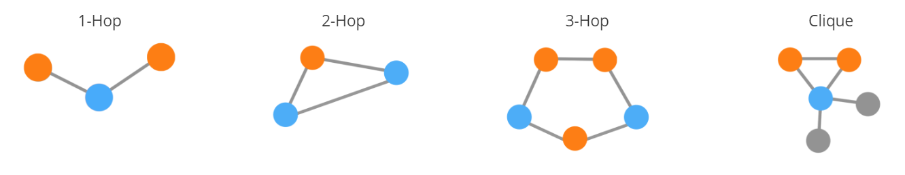
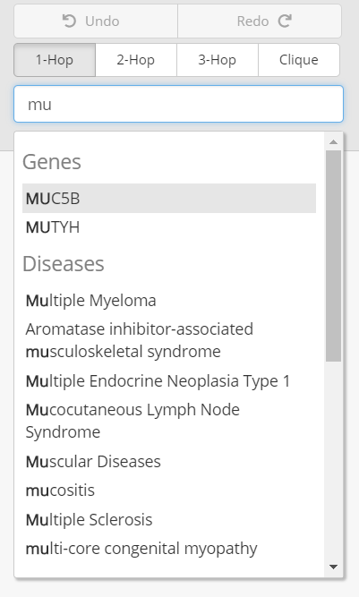

# Using GeneDive {#usage}

### Navigation
1. [Main](@ref mainpage)  
2. [Usage](@ref usage)  
3. [Support](@ref support)  

## Searching

When you successfully login, you will be presented with a large area in the center of the screen for results, along with a search and filter section on the left side of the screen.  

The four choices, 1-Hop, 2-Hop, 3-Hop, and Clique will determine the results that are presented.

**1-Hop:** This will search for results that are directly interacting with one another. If 1 item is selected, then all direct interactions with that one item will be presented. If more than one item is selected, then only direct interactions with those items will be shown.  
**2-Hop:** This search will present results whom mutually interact with the same items. The intermediates will be highlighted in orange. This requires more than 1 item to be specified.  
**3-Hop:** This search will present results whom's direct interactions mutually interact with each other. The intermediates will be highlighted in orange.  This requires more than 1 item to be specified.  
**Clique:** Similar to 1-Hop, except only the results that are 1 jump away from the search that are related to one another will be presented. You are limited to one item at a time when in this search mode.  

**Search Bar:** This will accept any string input. Upon typing in your query, GeneDive will lookup the query amongst genes, chemicals, diseases, and genesets, and present the findings below, which you can either click on or use the arrow keys and hit enter to select.  

More than one item can be selected from the list, but only if you are choosing 1, 2, or 3-Hops. Clique does not support mulitple item selection.  

**Minimum Probability:** This option allows you to choose the threshold for the probability of gene interactions. The relationship between every gene is given a probability value, from 0 to 1, based on how they they are presented in the article. Lowering this value will present more results, but will increase the possibility of false positives. Increasing this value will narrow results, but will increase the possibility of false negatives.

You can see the probability values in the results table, under Probability.

Warning: The lower the probability value, the longer a data set will take to load. Only tweak this value in relatively small increments.

**Filtering:** You can further filter results down by Article, Exerpt, Gene, Journal, and Section. Upon adding an "is" filter, all results not containing the filter will be hidden. If you add a "not" filter, any results matching the filter's value will be hidden.

These filters are processed locally, so any filters applied and removed will result in near instantanious changes.

**Highlight Rows:** When you enter strings in here, any results that contain that contain that value in their data will be highlighted in the table view. Edges will also be highlighted in the graph view.

**Group Table Results By:** Results by default are presented as Genes. Clicking on a gene result will present a list of articles that the gene was featured in. By switching this to Article, you can instead group by Articles.

## Results

The majority of screen space is taken up in the middle by the results. On the top is a table of the results, and the bottom a graph.

**Results Table:** The results here are grouped by gene interactions by default. You can group them by article interactions by clicking on Articles at the bottom of the Search area, under Group Table Results By. You can sort the table by clicking the small, black arrows next to each field header. If there is only one visible arrow, then the table is currently sorted by the non-visible arrow that is paired with that visible one.

Clicking on a table row will present you with all the interactions of that group. You can go directly to the article by clicking on the link under the Pubmed column. To return to the grouped results, click Back at the top left of the table.

**Gene Graph:** The graph below the table presents a visual representation of the gene interactions. The thickness of an edge represents how many interactions between the gene there are in the articles. The color of the node corresponds to the colors of the search items, located under the search bar.

 

The graph can also be visually modified in a number of ways, along with being used to alter your search parameters.

Moving nodes: Click on a node, then drag it to reposition the node.  
Zoom: Use your mouse wheel, or your zoom feature on your trackpad, to zoom in and out.  
Add to search: You can add genes to your search by holding shift, then clicking each of the nodes you want to add. Keep holding shift until you have selected all the genes you would like to add. Upon letting go of shift, the new search will be made.  
New Search (replace): You can do a brand new search for 1 gene, by holding CTRL and clicking on a node. Upon clicking on a node, a new search will immediately be made.
